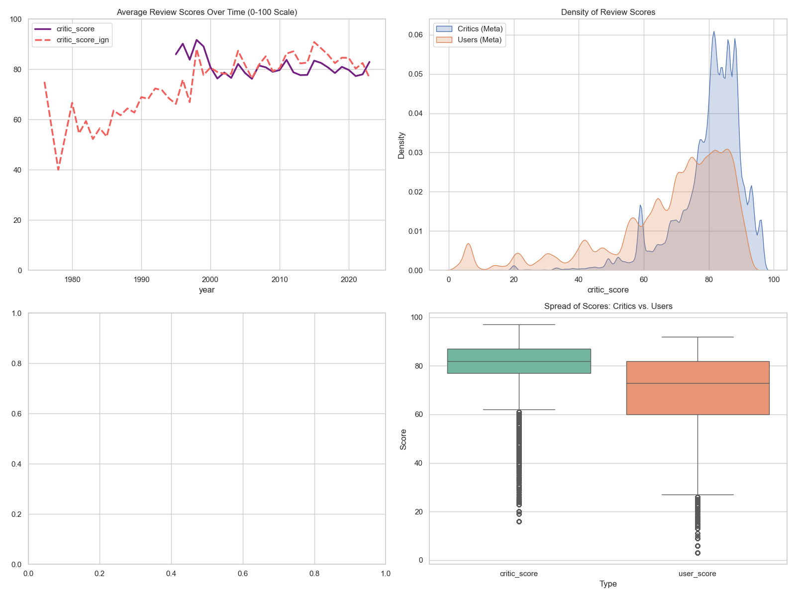

# 📊 Final Analysis & Research Findings

This section summarizes the results of the statistical tests conducted on the combined datasets from **Metacritic**, **OpenCritic**, and **IGN**.

---

## 1. Hypothesis Testing Results

### **Hypothesis 1: Expert Score Inflation**
> *Experts give higher scores in recent years than in the past.*
* **Method:** Pearson Correlation Coefficient ($r$) between `year` and `critic_score`.
* **Result:** r = -0.014604 This shows a very slight negative correlation.
* **Finding:** Contrary to the idea of "review inflation," data suggests that as time goes on, critic scores have actually dropped by a tiny amount. Because the P-Value is so small (1.81 \times 10^-37), this tiny downward trend is mathematically real, not a fluke..

### **Hypothesis 2: Critic vs. User Sentiment**
> *Players give lower scores than expert reviewers on average.*
* **Method:** Paired T-Test comparing normalized Critic Scores vs. User Scores.
* **Result:** t = 655.02$, p = 0.0 Hypothesis Supported.
* **Finding:** A T-stat of 655 is massive. This confirms that there is a giant, consistent gap where critics score games higher than users. The P-value of 0.0 means the probability that this gap is a mistake is zero.

### **Hypothesis 3: IGN Specific Trends**
> *IGN gives higher scores in recent years than in the past.*
* **Method:** Pearson Correlation specifically for the IGN dataset.
* **Result:** IGN vs Year Stat = 0.049105 p = 4.664288e-244 Hypothesis Supported.
* **Finding:** Unlike the general critic pool (H1), IGN’s scores are actually rising over time (r is positive). While the rise is small, the P-value (4.66 \times 10^{-244}) is so low that it confirms IGN has a specific trend of giving slightly higher scores in recent years.

### **Hypothesis 4: The Variance Gap (Polarization)**
> *The variance of user scores is higher than critic scores.*
* **Method:** Levene’s Test for Equality of Variances.
* **Result:** Variance (User vs Critic) W = 132740.69, p = 0.0 Hypothesis Supported.
* **Finding:** This is strongest result. The variance of users is significantly higher than critics. This mathematically proves that users are "unpredictable" and "extreme" (using 0s and 10s), while critics are "stable" and "conservative" (staying in the 70-80 range).

---

## 2. Visualization Analysis

### **Distribution of Scores**
Our density plots (KDE) show that Critic scores follow a **Normal Distribution** (bell curve), while User scores are **Skewed** and show more "noise" at the lower end of the spectrum.

## 🏆 The "Controversy Gap": Top 5 Most Disputed Titles

The following table identifies games with the largest absolute discrepancy between professional critics and the general public. These titles represent significant "Review Bombing" incidents or major disconnects between technical quality and player satisfaction.

| Game Title | Critic Score | User Score | Controversy Gap |
| :--- | :---: | :---: | :---: |
| **Tom Clancy's The Division 2: Warlords of New York** | 79.0 | 9.0 | **70.0** |
| **Diablo IV** | 86.0 | 20.0 | **66.0** |
| **Overwatch 2** | 79.0 | 14.0 | **65.0** |
| **The Sims 4: Star Wars - Journey to Batuu** | 70.0 | 11.0 | **59.0** |
| **FIFA 21** | 74.0 | 15.0 | **59.0** |

---

### 🔍 Analysis of Outliers
1. **The "Live Service" Effect:** Almost all games in the Top 5 are "Live Service" titles or expansions. The high gap is often caused by post-launch monetization, server issues, or balance changes that critics (who review the launch version) don't weight as heavily as daily players.
2. **Extreme Disparity:** A gap of **70.0 points** (as seen in *The Division 2*) is statistically extreme. In these cases, the `user_score` is rarely a reflection of the game's art or mechanics, but rather a form of "protest voting."
3. **Hypothesis Link:** This list provides qualitative proof for **Hypothesis 4**. The fact that users gave a 9.0/100 while critics gave a 79/100 demonstrates the high variance and polarization found in player datasets.
                                          
### **Annual Controversy**
Using `top_discrepancies_per_year` function, identified the most "divisive" games by year.
*output*
============================================================
TOP 5 MOST CONTROVERSIAL GAMES PER YEAR
============================================================
  year                                                   game  critic_score  user_score  score_diff
1995.0                                          Full Throttle          86.0        85.0         1.0
1996.0                                              Harvester          53.0        74.0       -21.0
1996.0                                                 Diablo          94.0        87.0         7.0
1996.0                            Sid Meier's Civilization II          94.0        87.0         7.0
1996.0                  Master of Orion II_ Battle at Antares          84.0        90.0        -6.0
1996.0                                                  Quake          94.0        88.0         6.0
1997.0                                Sid Meier's Gettysburg!          92.0        73.0        19.0
1997.0                                               Obsidian          85.0        71.0        14.0
1997.0                       Broken Sword_ The Smoking Mirror          69.0        80.0       -11.0
1997.0                                                 Postal          56.0        67.0       -11.0
1997.0                                           Blood (1997)          82.0        88.0        -6.0
1998.0                                       The X-Files Game          56.0        77.0       -21.0
1998.0                           Emergency_ Fighters for Life          71.0        77.0        -6.0
1998.0                                             Falcon 4.0          85.0        79.0         6.0
1998.0                                              Fallout 2          86.0        91.0        -5.0
1998.0                                              Half-Life          96.0        91.0         5.0
1999.0                                  Sid Meier's Antietam!          82.0        50.0        32.0
1999.0                           Total Annihilation_ Kingdoms          74.0        84.0       -10.0
1999.0                   Septerra Core_ Legacy of the Creator          70.0        78.0        -8.0
1999.0                                              EverQuest          85.0        79.0         6.0
1999.0                                              Homeworld          93.0        88.0         5.0
2000.0                                            Dino Crisis          59.0        85.0       -26.0
2000.0                                               NHL 2001          90.0        66.0        24.0
2000.0                                Carmageddon 3_ TDR 2000          48.0        71.0       -23.0
2000.0                                             Links 2001          86.0        64.0        22.0
2000.0                                        Madden NFL 2001          78.0        58.0        20.0
2001.0                                   Jekyll & Hyde (2001)          34.0        68.0       -34.0
2001.0                                            Robot Arena          41.0        70.0       -29.0
2001.0                                           Original War          61.0        88.0       -27.0
2001.0                                         Outlive (2001)          59.0        84.0       -25.0
2001.0                                                America          50.0        74.0       -24.0
2002.0                              Tiger Woods PGA Tour 2003          92.0        50.0        42.0
2002.0                                            Dino Island          42.0        75.0       -33.0
2002.0                              NASCAR Racing 2002 Season          89.0        56.0        33.0
2002.0                         Delta Force_ Task Force Dagger          51.0        76.0       -25.0
2002.0                                Demonworld_ Dark Armies          33.0        58.0       -25.0
2003.0                                               Postal 2          50.0        81.0       -31.0
2003.0                                       Paradise Cracked          48.0        78.0       -30.0
2003.0                      Victoria_ An Empire Under the Sun          58.0        87.0       -29.0
2003.0                                               Mistmare          33.0        61.0       -28.0
2003.0                                       The Black Mirror          58.0        85.0       -27.0
2004.0                              Tiger Woods PGA Tour 2005          91.0        40.0        51.0
2004.0                                               Torrente          36.0        80.0       -44.0
2004.0                                           SuperPower 2          51.0        80.0       -29.0
2004.0                                              Alexander          56.0        84.0       -28.0
2004.0                                Massive Assault Network          74.0        46.0        28.0
2005.0                                       NASCAR SimRacing          85.0        49.0        36.0
2005.0                               RYL_ Path of the Emperor          50.0        85.0       -35.0
2005.0                 Battle of Britain II_ Wings of Victory          75.0        43.0        32.0
2005.0                        RollerCoaster Tycoon 3_ Soaked!          79.0        47.0        32.0
2005.0                             DreamWorks Shrek SuperSlam          69.0        39.0        30.0
2006.0                     American McGee Presents Bad Day LA          28.0        69.0       -41.0
2006.0                                 Hard Truck_ Apocalypse          45.0        83.0       -38.0
2006.0                                                 NHL 07          72.0        44.0        28.0
2006.0                           Brigade E5_ New Jagged Union          41.0        68.0       -27.0
2006.0                                        Bionicle Heroes          59.0        83.0       -24.0
2007.0                             Thrillville_ Off the Rails          70.0        37.0        33.0
2007.0                 World of Warcraft_ The Burning Crusade          91.0        60.0        31.0
2007.0                            Combat Mission_ Shock Force          62.0        32.0        30.0
2007.0                                                 SunAge          44.0        74.0       -30.0
2007.0                                          You Are Empty          34.0        58.0       -24.0
2008.0                                                CSI_ NY          53.0        21.0        32.0
2008.0                                                  Spore          84.0        58.0        26.0
2008.0                             Spider-Man_ Web of Shadows          52.0        77.0       -25.0
2008.0                                              Far Cry 2          85.0        61.0        24.0
2008.0                                        Warriors Orochi          51.0        75.0       -24.0
2009.0                                  Football Manager Live          82.0        31.0        51.0
2009.0                         Call of Duty_ Modern Warfare 2          86.0        47.0        39.0
2009.0                                              Cities XL          69.0        41.0        28.0
2009.0                                      League of Legends          78.0        50.0        28.0
2009.0                    Operation Flashpoint_ Dragon Rising          76.0        50.0        26.0
2010.0                 Command & Conquer 4_ Tiberian Twilight          64.0        21.0        43.0
2010.0                                       Starpoint Gemini          46.0        84.0       -38.0
2010.0                                          Hotel Giant 2          58.0        26.0        32.0
2010.0                           World of Warcraft_ Cataclysm          90.0        58.0        32.0
2010.0                 Tom Clancy's Splinter Cell_ Conviction          83.0        56.0        27.0
2011.0                                 Battlefield_ Play4Free          68.0        20.0        48.0
2011.0                         Call of Duty_ Modern Warfare 3          78.0        31.0        47.0
2011.0                                         World of Tanks          80.0        34.0        46.0
2011.0                                          Dragon Age II          82.0        47.0        35.0
2011.0                                The Sims 3_ Generations          70.0        39.0        31.0
2012.0                                             Diablo III          88.0        42.0        46.0
2012.0                              Super Monday Night Combat          76.0        37.0        39.0
2012.0                               Thirty Flights of Loving          88.0        50.0        38.0
2012.0         Need for Speed_ Most Wanted - A Criterion Game          78.0        45.0        33.0
2012.0                                                   7554          41.0        73.0       -32.0
2013.0                                    Company of Heroes 2          80.0        22.0        58.0
2013.0                                   Call of Duty_ Ghosts          68.0        23.0        45.0
2013.0                                            War Thunder          81.0        38.0        43.0
2013.0                                                SimCity          64.0        22.0        42.0
2013.0                                               Payday 2          79.0        39.0        40.0
2014.0                 World of Warcraft_ Warlords of Draenor          87.0        39.0        48.0
2014.0                                               ArcheAge          80.0        37.0        43.0
2014.0                                               Sacred 3          57.0        15.0        42.0
2014.0                                                FIFA 15          82.0        45.0        37.0
2014.0                        Hearthstone_ Heroes of Warcraft          88.0        57.0        31.0
2015.0 Hearthstone_ Heroes of Warcraft - The Grand Tournament          84.0        40.0        44.0
2015.0                               2064_ Read Only Memories          80.0        44.0        36.0
2015.0                            Call of Duty_ Black Ops III          73.0        37.0        36.0
2015.0                                  Star Wars Battlefront          72.0        36.0        36.0
2015.0                                          Sunset (2015)          66.0        30.0        36.0
2016.0                            Out of the Park Baseball 17          92.0        33.0        59.0
2016.0                                       Street Fighter V          74.0        32.0        42.0
2016.0                                                FIFA 17          84.0        43.0        41.0
2016.0                                               NightCry          44.0        84.0       -40.0
2016.0                    Baldur's Gate_ Siege of Dragonspear          77.0        38.0        39.0
2017.0                                                FIFA 18          81.0        31.0        50.0
2017.0                                               Fortnite          81.0        35.0        46.0
2017.0                             Destiny 2_ Curse of Osiris          61.0        18.0        43.0
2017.0   Hearthstone_ Heroes of Warcraft - Journey to Un'Goro          79.0        38.0        41.0
2017.0                                              Destiny 2          83.0        43.0        40.0
2018.0                  World of Warcraft_ Battle for Azeroth          79.0        23.0        56.0
2018.0                             Magic_ The Gathering Arena          84.0        29.0        55.0
2018.0                                               Artifact          76.0        22.0        54.0
2018.0                                          Battlefield V          81.0        30.0        51.0
2018.0                              Call of Duty_ Black Ops 4          83.0        32.0        51.0
2019.0                           Call of Duty_ Modern Warfare          81.0        27.0        54.0
2019.0                                       Bury Me, My Love          80.0        30.0        50.0
2019.0                                       Mortal Kombat 11          82.0        33.0        49.0
2019.0                                Wolfenstein_ Youngblood          69.0        24.0        45.0
2019.0                            Tom Clancy's The Division 2          84.0        46.0        38.0
2020.0      Tom Clancy's The Division 2_ Warlords of New York          79.0         9.0        70.0
2020.0                                                FIFA 21          74.0        15.0        59.0
2020.0               The Sims 4_ Star Wars - Journey to Batuu          70.0        11.0        59.0
2020.0                         World of Warcraft_ Shadowlands          83.0        26.0        57.0
2020.0                                 Warcraft III_ Reforged          59.0         6.0        53.0
2021.0                             Blizzard Arcade Collection          79.0        25.0        54.0
2021.0                                       Battlefield 2042          68.0        21.0        47.0
2021.0                                 Diablo II_ Resurrected          80.0        33.0        47.0
2021.0                                                F1 2021          86.0        41.0        45.0
2021.0 Grand Theft Auto_ The Trilogy - The Definitive Edition          49.0         6.0        43.0
2022.0                                            Overwatch 2          79.0        14.0        65.0
2022.0                                    Monster Hunter Rise          86.0        28.0        58.0
2022.0                                  Call of Duty_ Warzone          80.0        24.0        56.0
2022.0                                        Diablo Immortal          59.0         3.0        56.0
2022.0                          Monster Hunter Rise_ Sunbreak          86.0        37.0        49.0
2023.0                                              Diablo IV          86.0        20.0        66.0
2023.0                               Star Wars Jedi_ Survivor          78.0        33.0        45.0
2023.0                                   Destiny 2_ Lightfall          66.0        22.0        44.0
2023.0                                  Curse of the Sea Rats          60.0        17.0        43.0
2023.0                                         Blood Bowl III          57.0        15.0        42.0

---

## 3. Final Conclusion
The data supports the conclusion that **Critics and Players utilize different evaluation frameworks.** Critics focus on technical execution and industry standards, while users respond more to emotional resonance and post-launch performance. The high variance in user scores confirms that the gaming community is more polarized than the professional review circle.

---
**Project by:** [Your Name]  
**Course:** DSA210 – Introduction to Data Science  
**Term:** Fall 2025
